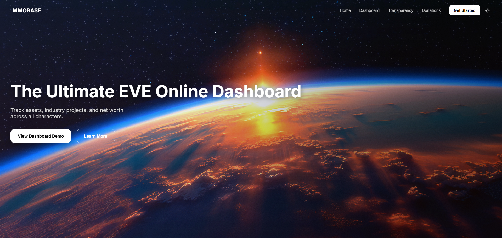
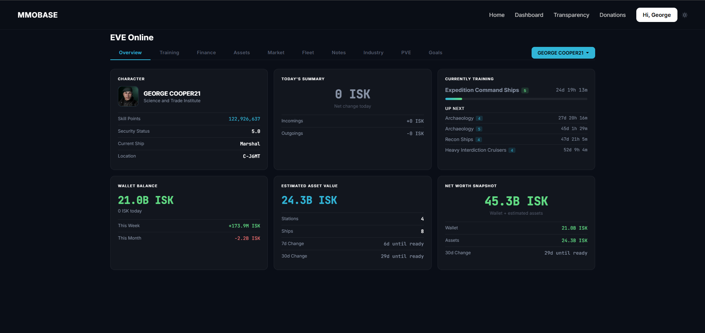
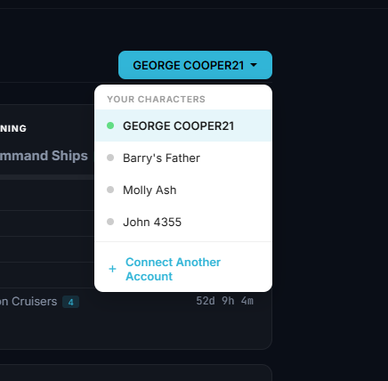

# MMOBase

MMOBase is a modern MMO analytics and character tracking platform, starting with EVE Online.

The goal is to give players a cleaner way to view characters, accounts, assets, wallet data, progression, and useful MMO statistics in one place.

## Screenshots

### Homepage



### Dashboard overview



### Multi-character tracking



## Current focus

- EVE Online character overview
- Multi-character tracking
- Wallet and asset overview
- Cleaner dashboards for MMO data
- Transparent development and community feedback

## Development status

MMOBase is currently in active development. Some areas are fully working, while others are still being improved, especially asset valuation accuracy.

## Transparency

Parts of the frontend and development workflow have been built with AI assistance. The project is reviewed, tested, and adjusted manually before release.

## Repositories

- Frontend: https://github.com/MMO-BASE/mmobase
- Backend API: https://github.com/MMO-BASE/mmobase-backend

## Setup

### Frontend

The frontend is a static HTML/CSS/JavaScript site.

To run it locally, clone the frontend repository:

```bash
git clone https://github.com/MMO-BASE/mmobase.git
cd mmobase
```

Then open `index.html` in your browser.

### Backend

The backend is a Node.js API server responsible for:

- EVE Online OAuth authentication
- Character syncing
- Wallet data processing
- Asset processing
- Snapshot/history systems
- Supabase integration
- API endpoints for dashboard data

To run it locally, clone the backend repository:

```bash
git clone https://github.com/MMO-BASE/mmobase-backend.git
cd mmobase-backend
```

Install dependencies:

```bash
npm install
```

Create a `.env` file using `.env.example` as a guide.

Required services include:

- Supabase
- EVE Online Developer Application
- OAuth callback configuration

Start the backend server:

```bash
npm start
```

### Security notes

Do not commit real `.env` files, API keys, secrets, tokens, passwords, or private credentials.

## Contributing

Contributions, feedback, bug reports, and suggestions are welcome.

MMOBase is still in active development, so the main areas where help is currently useful are:

- Bug reports
- UI/UX feedback
- Asset valuation improvements
- EVE Online API/ESI handling
- Code review and cleanup
- Performance improvements
- Documentation improvements

### How to contribute

1. Open an issue describing the bug, idea, or improvement.
2. Fork the relevant repository.
3. Create a new branch for your change.
4. Make your changes.
5. Open a pull request with a clear explanation of what you changed.

### Contribution notes

- Please keep changes focused and easy to review.
- Do not commit real `.env` files, API keys, tokens, secrets, passwords, or private credentials.
- Security-related issues should be raised carefully and responsibly.
- MMOBase is currently a work-in-progress, so some systems may change as the project develops.

All constructive feedback is appreciated.

## Roadmap

Planned improvements include:

- Better asset valuation
- Historical tracking
- More detailed character analytics
- Corporation and account-level tools
- Improved UI and mobile support
- Potential support for more games in the future

## Website

https://mmobase.co.uk
